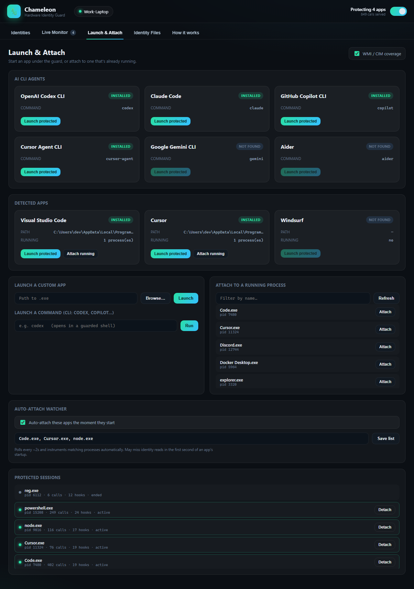

# 🦎 Chameleon — Hardware Identity Guard


Chameleon sits **between an app and the Windows functions that reveal your
hardware identity**. When you launch an app "protected", a lightweight Frida
agent is injected into it (and the helper processes it spawns, like `reg.exe`).
Every time the app asks Windows for a machine id, MAC, volume serial, SMBIOS
serial/UUID, or hostname, the call is **logged and answered with a fake value**
from your active *identity profile*.

This is aimed at the new wave of desktop AI apps (Codex, Copilot, Cursor, VS
Code, …) that fingerprint your device. Instead of changing your real machine
(which breaks activation and is irreversible), Chameleon just *lies to the apps
you choose* — and stops lying the moment you detach.

> **Your real machine is never modified.** Nothing is written to your registry
> or firmware. Detach (or toggle Protection off) and apps instantly see the
> real values again.

## Intended use

Chameleon is a privacy tool for **your own machine**: it decides what *your*
apps learn about *your* hardware. That is the whole scope. It is not built for,
and is a poor fit for, evading bans, defeating licensing or trial limits, or
misrepresenting a machine to someone else's service — it spoofs only inside
processes you launch, and everything it does disappears when you detach. Check
the terms of any software you point it at; some prohibit this regardless of
intent.

---

## Screenshots

**Identities** — each profile is a self-consistent set of fake hardware IDs; one click generates a fresh one, one click activates it. **Verify active** proves, per identifier, what apps actually receive.


**Launch & Attach** — one-click guarded launch for detected AI CLIs and editors, attach-to-running, and an auto-attach watcher that instruments apps the moment they start.



**Live Monitor** — every hardware-ID call a protected app makes, in real time, with the real value it asked for and the value served back.


<sub>Screenshots use generated demo identities throughout; in the UI the "real" value is struck through.</sub>

## Why interception instead of a "HWID changer"

Most HWID spoofers permanently rewrite registry keys or use a kernel driver to
patch firmware — machine-wide, risky, and hard to undo. Chameleon scopes the
problem to privacy from *specific apps* instead:

* **Per-app** — you see exactly which app asked for which identifier.
* **Reversible by design** — hooks live only inside the target process.
* **No machine damage** — real IDs, licenses and activation are untouched.
* **Covers "firmware" too** — hooking `GetSystemFirmwareTable` means the app
  receives a fake BIOS/board serial even though the real firmware is unchanged.

---

## What gets intercepted

| Identifier | Windows function(s) hooked | Verified |
|---|---|---|
| **MachineGuid**, SQMClient MachineId, ProductId, HwProfileGuid, BuildGUID, SusClientId | `RegQueryValueEx`, `RegGetValue`, `RegEnumValue` | ✅ |
| **SMBIOS** system/board/chassis serial, system UUID, CPU id | `GetSystemFirmwareTable('RSMB')` | ✅ |
| **MAC** addresses | `GetAdaptersAddresses`, `GetAdaptersInfo` | ✅ |
| **Volume serial** | `GetVolumeInformation(W/A)`, `…ByHandleW` | ✅ |
| **Physical disk serial** | `DeviceIoControl(IOCTL_STORAGE_QUERY_PROPERTY)` | ✅ |
| **Hostname** | `GetComputerName(W/A)`; `GetComputerNameEx` caller-guarded (RPC-safe) | ✅ |
| **WMI** serials / UUID / ProcessorId / MAC / volume / disk / hostname | client-side COM: `IWbemClassObject::Get` + property-enum `Next` | ✅ |
| **MI / CIM** (`Get-CimInstance`, `Get-PhysicalDisk`, `Get-NetAdapter`) — same identifiers, plus `MSFT_PhysicalDisk` serial/UniqueId and `MSFT_NetAdapter` addresses | same COM layer, reached through `IWbemServices::*Async` + `IWbemObjectSink::Indicate` | ✅ |
| **Hostname inside WMI/CIM metadata** (`__SERVER`, `__PATH`, `CimSystemProperties.ServerName`, `ObjectId`) | rewritten outbound, repaired inbound so paths still resolve | ✅ |

The `reg.exe` child process that `node-machine-id` (used by VS Code / Electron
apps) shells out to is caught automatically via Frida **child-gating**.

### WMI and MI / CIM coverage
`WmiPrvSE.exe` (the WMI provider host) runs as NETWORK SERVICE and refuses
injection, so both management stacks are intercepted **client-side**: a protected
app's query results are unmarshaled into its own process and read via COM, which
is hooked.

One hook point covers both, because **locally, MI does not have its own
transport**. `mi.dll` exports just `MI_Application_InitializeV1` and
`mi_clientFT_V1`, and for a local operation it loads `wmidcom.dll` — an ordinary
DCOM WMI client that goes `CoCreateInstance(CLSID_WbemLocator)` →
`IWbemLocator::ConnectServer` → `IWbemServices`, uses the *asynchronous* entry
points, and receives results through an `IWbemObjectSink`. The objects that sink
delivers are plain in-process `IWbemClassObject`s, which `wmidcom` then reads
with `Get`/`Next` to build each `MI_Instance`. So hooking those two COM methods —
plus the async sinks that deliver MI's objects — covers classic WMI and CIM
together, using only frozen COM ABI rather than `mi.dll`'s build-specific
internal function-table layout.

Verified coverage on Windows 11:

* classic WMI — .NET `System.Management`, PowerShell `Get-WmiObject`, `wmic.exe`
  where it still exists, and Node libs that shell out to it (e.g. `systeminformation`);
* MI / CIM — `Get-CimInstance` (`Win32_BIOS`, `BaseBoard`, `SystemEnclosure`,
  `ComputerSystemProduct`, `Processor`, `DiskDrive`, `LogicalDisk`, `Volume`,
  `NetworkAdapterConfiguration`, `ComputerSystem`, `OperatingSystem`),
  `Get-PhysicalDisk` / `Get-Disk` (`MSFT_PhysicalDisk`, `MSFT_Disk` — including
  `UniqueId`) and `Get-NetAdapter` (`MSFT_NetAdapter` `PermanentAddress` and
  `NetworkAddresses`).

Values are class-aware, so `BaseBoard`, `SystemEnclosure` and `DiskDrive` each
get their own serial rather than a single shared one, and format-preserving, so
a MAC comes back punctuated the way the real one was (`AA:BB:…`, `AA-BB-…` or
`AABB…`). String, numeric and string-array properties are all handled —
`Win32_Volume.SerialNumber` is a `uint32` rather than a string, and
`MSFT_NetAdapter.NetworkAddresses` is an array. Object paths carrying the
machine name are rewritten on the way out and repaired on the way back in, so
`[wmi]$obj.__PATH` and pipelines such as `Get-PhysicalDisk | Get-Disk` keep
working inside a guarded app.

**WMI / CIM coverage** can be switched off in the **Launch & Attach** tab; the
change applies to the next launch.

### AI CLI agents
The Launch tab auto-detects known AI coding CLIs on `PATH` — Codex, Claude Code,
GitHub Copilot (`copilot` / `gh copilot`), Gemini, Aider, Cursor Agent, Qwen,
opencode, Amazon Q — and launches them in a guarded shell so child-gating
instruments the node/python/reg helpers they spawn.

### Verify & auto-attach
- **Verify active** (Identities tab) launches probe tools *under the guard* and
  shows, per identifier, whether the app actually receives the profile's fake
  value — live proof that coverage is working. Results are grouped by the stack
  the value was read through (Windows API / WMI / MI · CIM), so each stack is
  proven separately.
- **Auto-attach watcher** (Launch tab) instruments a configurable watch-list of
  apps the moment they start, so you don't have to launch each one through the
  guard. It polls every ~2s, so reads in the first second of an app's startup
  can slip through — launch-through-guard stays exact when that matters.

### Identity Files (complementary layer)
Some apps cache their id in a file instead of re-reading it. VS Code, its forks
(Insiders / VSCodium / Cursor) and Copilot-in-VS-Code keep telemetry ids in
`%APPDATA%\<App>\User\globalStorage\storage.json`
(`telemetry.machineId` / `macMachineId` / `devDeviceId` / `sqmId`). The
**Identity Files** tab backs that file up and writes your active profile's ids
into it, reversibly.

---

## Known limitations

* **MI over WSMan isn't intercepted.** Only MI's *local* transport rides on DCOM.
  An explicit `New-CimSession -ComputerName <host>` (WSMan/WinRM) leaves the
  machine, so it is neither hooked nor, for a remote host, meaningful to hook.
  The default local session that `Get-CimInstance` uses is fully covered.
* **Network adapter GUIDs are left alone.** `Win32_NetworkAdapter.GUID`,
  `MSFT_NetAdapter.InterfaceGuid` / `DeviceID` are machine-stable, but they are
  also the keys the networking stack addresses adapters by; rewriting them breaks
  network cmdlets inside the guarded app for little privacy gain over the MAC,
  which *is* spoofed.
* **Hostname vs. local RPC.** Hostname is spoofed via `GetComputerName` and
  `GetComputerNameEx`, plus WMI results. Since local RPC/DCOM binds to the WMI
  host through `GetComputerNameEx`, that hook only rewrites when the caller isn't
  a system RPC/COM/WMI module, and the WMI hook redirects a client's fake-host
  connection back to local — so apps see the fake name while WMI keeps working.
* **Elevation.** Chameleon requests Administrator rights at startup, because
  attaching to an already-running or elevated process needs them. Decline the
  prompt and it keeps running unelevated — launching an app *through* the guard
  still works and is fully protected; only attach-to-running and the auto-attach
  watcher are unavailable, and the UI says so.
* **Anti-tamper / EDR.** Frida injects into the target; hardened apps or
  aggressive AV/EDR may detect or block it. The mainstream AI/editor apps do
  not.
* Rotating ids can sign you out of apps or affect licenses tied to hardware.
  This tool is for protecting your own privacy on your own machine.

---

## Requirements

| | |
|---|---|
| OS | Windows 10 or 11, 64-bit |
| Python | 3.10+ (64-bit) — only if running from source |
| Runtime | Microsoft Edge **WebView2** (preinstalled on Windows 11 and current Windows 10; otherwise install the [Evergreen bootstrapper](https://developer.microsoft.com/microsoft-edge/webview2/)) |
| Privileges | Chameleon **asks for Administrator rights automatically** at startup (a UAC prompt) — they are what lets it attach to already-running or elevated apps. Decline the prompt and it keeps running, just unelevated: launching an app *through* Chameleon still works, attaching to a running one does not. Developers can skip the prompt with `--no-elevate` or `CHAMELEON_NO_ELEVATE=1`. |

Dependencies (`requirements.txt`): [Frida](https://frida.re) 17+ for the
instrumentation, pywebview + pythonnet for the WebView2 UI.

## Install & run

```bat
git clone https://github.com/myounis1996/chameleon-guard.git
cd chameleon-guard
pip install -r requirements.txt
run.bat
```

`run.bat` is equivalent to `python app.py`. To produce a single-file
`Chameleon.exe` instead, see [Building the release .exe](#building-the-release-exe).

> Your generated profiles, engine state and Identity-File backups live in
> `data/`, which is **gitignored** — the backups contain your machine's **real**
> ids, so keep them out of version control.

### Usage
1. **Identities** — **＋ New Identity** generates a full, consistent fake machine
   in one click (the first auto-activates); **Activate** any card to switch.
   **Verify active** launches probe tools *under the guard* and shows, per
   identifier, whether apps really receive the fake value.
2. **Launch & Attach**
   - **AI CLI agents**: one-click **Launch protected** for detected CLIs (Codex,
     Claude Code, Copilot, Gemini, Aider, …).
   - **Detected apps**: **Launch protected** for VS Code / Cursor / …, or paste
     any `.exe` path or command line.
   - **Attach** to an already-running process.
   - **Auto-attach watcher**: toggle on and set a watch-list to instrument apps
     automatically as they start.
   - **WMI / CIM coverage** toggle (applies to the next launch).
3. **Live Monitor** — every intercepted call in real time: counts per app and per
   function, and real → served for each.
4. **Identity Files** — for VS Code-family apps that cache their id in
   `storage.json`; backed up before any change and restorable.
5. **Protection** toggle (top-right) detaches everything and restores real values.

---

## Project layout

```
chameleon-guard/
├─ app.py                    # pywebview window + JS API bridge + app discovery
├─ run.bat                   # launcher (double-click)
├─ build-release.bat         # build dist\Chameleon.exe (double-click)
├─ requirements.txt
├─ engine/
│  ├─ profiles.py            # identity generator + profile store
│  ├─ agent.js               # Frida agent: the hooks (injected into targets)
│  ├─ interceptor.py         # spawn/attach, child-gating, live stats
│  └─ identity_files.py      # VS Code family storage.json backup/patch/restore
├─ ui/
│  ├─ index.html  styles.css  app.js
└─ data/                     # profiles/, backups/, state.json  (created at runtime)
```

## Building the release .exe

**Double-click `build-release.bat`** — it locates Python, installs the build
dependencies, and produces a single self-contained `dist\Chameleon.exe` (~52 MB,
dead modules excluded, compiled with `--optimize 2`). `--uac-admin` gives the exe
a `requireAdministrator` manifest, so Windows prompts for elevation on every start.

Or run the equivalent manually:

```bat
pip install pyinstaller
pyinstaller --noconfirm --clean --onefile --windowed --uac-admin --name Chameleon ^
  --add-data "ui;ui" --add-data "engine/agent.js;engine" ^
  --collect-all frida --collect-all pythonnet --collect-all clr_loader --collect-all webview ^
  --exclude-module tkinter --exclude-module PyQt5 --exclude-module PyQt6 ^
  --exclude-module PySide2 --exclude-module PySide6 --exclude-module PIL ^
  --exclude-module numpy --exclude-module pandas --exclude-module scipy ^
  --exclude-module matplotlib --exclude-module IPython --exclude-module pytest ^
  --exclude-module notebook --exclude-module sqlite3 ^
  --exclude-module webview.platforms.gtk --exclude-module webview.platforms.qt ^
  --exclude-module webview.platforms.cocoa --exclude-module webview.platforms.android ^
  --optimize 2 app.py
```

**On the size:** the weight is Frida's native core (`_frida.pyd` is ~112 MB
uncompressed; PyInstaller's zlib brings the whole app to ~52 MB). UPX is
intentionally **not** used — it can corrupt Frida's embedded agent and makes
antivirus false-positives far more likely.

**Two notes for distribution:**
- The WebView2 **runtime** must be present on the target machine (it is on
  Windows 11 and up-to-date Windows 10/Server; otherwise ship the Evergreen
  bootstrapper).
- Because it bundles Frida and injects into other processes, some antivirus /
  EDR may flag the exe.

## Contributing

Issues and PRs welcome. Coverage gaps are the most useful reports: say which
**app** read which **identifier**, and how you observed the real value getting
through (the Live Monitor and **Verify active** panel are the quickest evidence).
New hooks belong in `engine/agent.js` and should follow the rules at the top of
that file — never resize a caller's buffer, never let a hook throw into the
target, and add a matching row to the Verify self-test in `app.py`.

## License

[MIT](LICENSE) (c) mohayo
