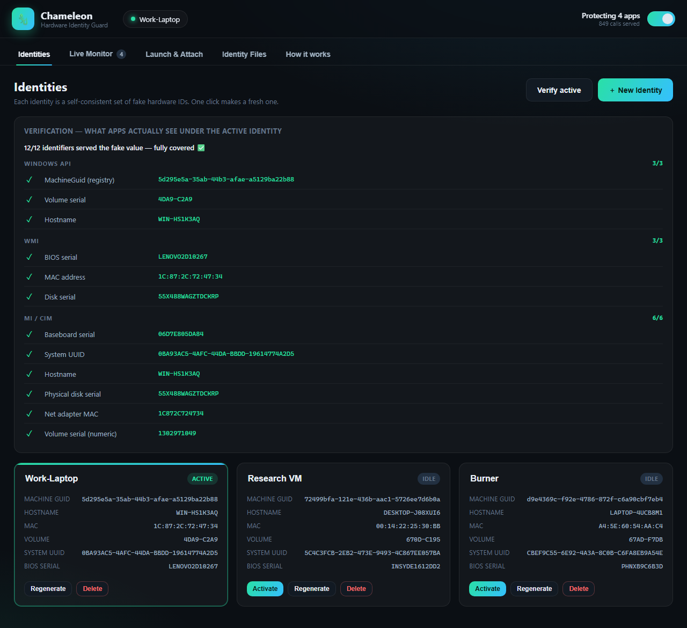
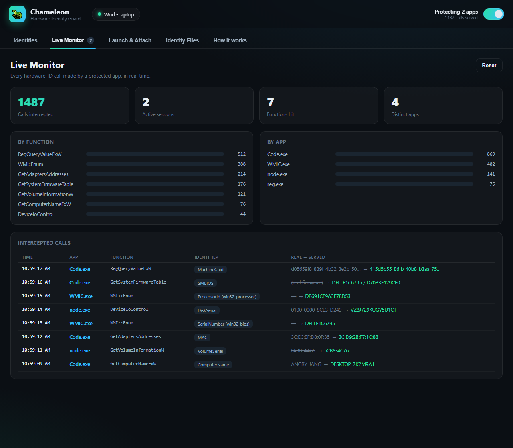

# 🦎 Chameleon — Hardware Identity Guard

Chameleon sits **between an app and the Windows functions that reveal your
hardware identity**. When you launch an app "protected", a lightweight Frida
agent is injected into it (and the helper processes it spawns, like `reg.exe`).
Every time the app asks Windows for a machine id, MAC, volume serial, SMBIOS
serial/UUID, or hostname, the call is **logged and answered with a fake value**
from your active *identity profile*.

This is aimed at the new wave of desktop AI apps (Codex, Copilot, Cursor, VS
Code, …) that fingerprint your device. Instead of changing your real machine
(which breaks activation and is irreversible), Chameleon just *lies to the apps
you choose* — and stops lying the moment you detach.

> **Your real machine is never modified.** Nothing is written to your registry
> or firmware. Detach (or toggle Protection off) and apps instantly see the
> real values again.

---

## Screenshots

**Identities** — each profile is a self-consistent set of fake hardware IDs; one click generates a fresh one, one click activates it.



**Live Monitor** — every hardware-ID call a protected app makes, in real time, with the real value it asked for and the value served back.



## Why interception instead of a "HWID changer"

Most HWID spoofers permanently rewrite registry keys or use a kernel driver to
patch firmware — machine-wide, risky, and hard to undo. Chameleon takes the
approach you actually want for privacy from *specific apps*:

* **Per-app** — you see exactly which app asked for which identifier.
* **Reversible by design** — hooks live only inside the target process.
* **No machine damage** — real IDs, licenses and activation are untouched.
* **Covers "firmware" too** — hooking `GetSystemFirmwareTable` means the app
  receives a fake BIOS/board serial even though the real firmware is unchanged.

---

## What gets intercepted

| Identifier | Windows function(s) hooked | Verified |
|---|---|---|
| **MachineGuid**, SQMClient MachineId, ProductId, HwProfileGuid, BuildGUID, SusClientId | `RegQueryValueEx`, `RegGetValue`, `RegEnumValue` | ✅ |
| **SMBIOS** system/board/chassis serial, system UUID, CPU id | `GetSystemFirmwareTable('RSMB')` | ✅ |
| **MAC** addresses | `GetAdaptersAddresses`, `GetAdaptersInfo` | ✅ |
| **Volume serial** | `GetVolumeInformation(W/A)`, `…ByHandleW` | ✅ |
| **Physical disk serial** | `DeviceIoControl(IOCTL_STORAGE_QUERY_PROPERTY)` | ✅ |
| **Hostname** | `GetComputerName(W/A)`; `GetComputerNameEx` caller-guarded (RPC-safe) | ✅ |
| **WMI** serials / UUID / ProcessorId / MAC / disk / hostname | client-side COM: `IWbemClassObject::Get` + property-enum `Next` | ✅ |

The `reg.exe` child process that `node-machine-id` (used by VS Code / Electron
apps) shells out to is caught automatically via Frida **child-gating**.

### WMI coverage
`WmiPrvSE.exe` (the WMI provider host) runs as NETWORK SERVICE and refuses
injection, so WMI is intercepted **client-side**: a protected app's WMI results
are unmarshaled into its own process and read via COM, which is hooked. This
covers the classic WMI stack — `wmic.exe`, .NET `System.Management`, PowerShell
`Get-WmiObject`, and Node libs that shell out to `wmic` (e.g. `systeminformation`).
Verified: `wmic bios/csproduct/cpu/baseboard/computersystem` and `Get-WmiObject`
all return the profile's values. Toggle it in the **Launch & Attach** tab
(applies to the next launch).

### AI CLI agents
The Launch tab auto-detects known AI coding CLIs on `PATH` — Codex, Claude Code,
GitHub Copilot (`copilot` / `gh copilot`), Gemini, Aider, Cursor Agent, Qwen,
opencode, Amazon Q — and launches them in a guarded shell so child-gating
instruments the node/python/reg helpers they spawn.

### Verify & auto-attach
- **Verify active** (Identities tab) launches a set of probe tools *under the
  guard* and shows, per identifier, whether the app actually receives the
  profile's fake value — live proof that coverage is working.
- **Auto-attach watcher** (Launch tab) instruments a configurable watch-list of
  apps the moment they start, so you don't have to launch each one through the
  guard. It polls every ~2s, so reads in the first second of an app's startup
  can slip through — launch-through-guard stays exact when that matters.

### Identity Files (complementary layer)
Some apps cache their id in a file instead of re-reading it. VS Code, its forks
(Insiders / VSCodium / Cursor) and Copilot-in-VS-Code keep telemetry ids in
`%APPDATA%\<App>\User\globalStorage\storage.json`
(`telemetry.machineId` / `macMachineId` / `devDeviceId` / `sqmId`). The
**Identity Files** tab backs that file up and writes your active profile's ids
into it, reversibly.

---

## Honest limitations

* **MI / CIM stack not rewritten.** `Get-CimInstance` (and apps on the newer MI
  API) read results through `mi.dll` function tables whose in-memory layout does
  not match the public `mi.h` on current Windows builds, so a reliable
  cross-version hook isn't feasible without per-build offset maintenance (which
  would risk crashing apps). Classic WMI — `wmic`, .NET `System.Management`,
  `Get-WmiObject`, and Node libs that shell out to `wmic` — **is** fully covered.
* **Hostname vs. local RPC.** Hostname is spoofed via `GetComputerName` and
  `GetComputerNameEx`, plus WMI results. Since local RPC/DCOM binds to the WMI
  host through `GetComputerNameEx`, that hook only rewrites when the caller isn't
  a system RPC/COM/WMI module, and the WMI hook redirects a client's fake-host
  connection back to local — so apps see the fake name while WMI keeps working.
* **Run as Administrator** to attach to already-running processes and to
  instrument elevated targets.
* **Anti-tamper / EDR.** Frida injects into the target; hardened apps or
  aggressive AV/EDR may detect or block it. The mainstream AI/editor apps do
  not.
* Rotating ids can sign you out of apps or affect licenses tied to hardware.
  This tool is for protecting your own privacy on your own machine.

---

## Install & run

Already set up on this machine (Python 3.12, Frida, pywebview, WebView2 runtime).

```bat
run.bat
```

or

```bat
python app.py
```

Fresh machine:

```bat
pip install -r requirements.txt
:: install the Microsoft Edge WebView2 runtime if missing
python app.py
```

### Usage
1. **Identities** — **＋ New Identity** generates a full, consistent fake machine
   in one click (the first auto-activates); **Activate** any card to switch.
   **Verify active** launches probe tools *under the guard* and shows, per
   identifier, whether apps really receive the fake value.
2. **Launch & Attach**
   - **AI CLI agents**: one-click **Launch protected** for detected CLIs (Codex,
     Claude Code, Copilot, Gemini, Aider, …).
   - **Detected apps**: **Launch protected** for VS Code / Cursor / …, or paste
     any `.exe` path or command line.
   - **Attach** to an already-running process.
   - **Auto-attach watcher**: toggle on and set a watch-list to instrument apps
     automatically as they start.
   - **WMI coverage** toggle (applies to the next launch).
3. **Live Monitor** — every intercepted call in real time: counts per app and per
   function, and real → served for each.
4. **Identity Files** — for VS Code-family apps that cache their id in
   `storage.json`; backed up before any change and restorable.
5. **Protection** toggle (top-right) detaches everything and restores real values.

---

## Project layout

```
hw_profile/
├─ app.py                    # pywebview window + JS API bridge + app discovery
├─ run.bat                   # launcher (double-click)
├─ build-release.bat         # build dist\Chameleon.exe (double-click)
├─ requirements.txt
├─ engine/
│  ├─ profiles.py            # identity generator + profile store
│  ├─ agent.js               # Frida agent: the hooks (injected into targets)
│  ├─ interceptor.py         # spawn/attach, child-gating, live stats
│  └─ identity_files.py      # VS Code family storage.json backup/patch/restore
├─ ui/
│  ├─ index.html  styles.css  app.js
└─ data/                     # profiles/, backups/, state.json  (created at runtime)
```

## Building the release .exe

**Double-click `build-release.bat`** — it locates Python, installs the build
dependencies, and produces a single self-contained `dist\Chameleon.exe` (~52 MB,
dead modules excluded, compiled with `--optimize 2`).

Or run the equivalent manually:

```bat
pip install pyinstaller
pyinstaller --noconfirm --clean --onefile --windowed --name Chameleon ^
  --add-data "ui;ui" --add-data "engine/agent.js;engine" ^
  --collect-all frida --collect-all pythonnet --collect-all clr_loader --collect-all webview ^
  --exclude-module tkinter --exclude-module PyQt5 --exclude-module PyQt6 ^
  --exclude-module PySide2 --exclude-module PySide6 --exclude-module PIL ^
  --exclude-module numpy --exclude-module pandas --exclude-module scipy ^
  --exclude-module matplotlib --exclude-module IPython --exclude-module pytest ^
  --exclude-module notebook --exclude-module sqlite3 ^
  --exclude-module webview.platforms.gtk --exclude-module webview.platforms.qt ^
  --exclude-module webview.platforms.cocoa --exclude-module webview.platforms.android ^
  --optimize 2 app.py
```

**On the size:** the weight is Frida's native core (`_frida.pyd` is ~112 MB
uncompressed; PyInstaller's zlib brings the whole app to ~52 MB). UPX is
intentionally **not** used — it can corrupt Frida's embedded agent and makes
antivirus false-positives far more likely.

**Two notes for distribution:**
- The WebView2 **runtime** must be present on the target machine (it is on
  Windows 11 and up-to-date Windows 10/Server; otherwise ship the Evergreen
  bootstrapper).
- Because it bundles Frida and injects into other processes, some antivirus /
  EDR may flag the exe. Run as Administrator.

## License

[MIT](LICENSE) (c) mohayo
